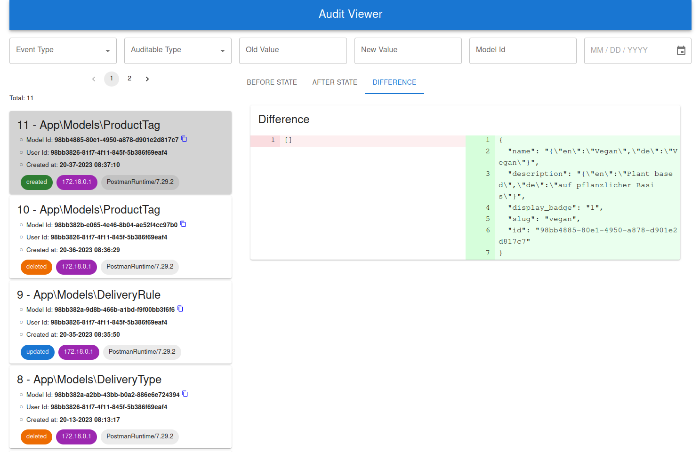

# Audit Viewer utility for [Laravel Auditing](https://laravel-auditing.com/)

## Welcome
This simple utility application allows you to interact with the audit data generated by teh Laravel Auditing package.
It has been built in java with the Spring framework. Why creating a tool for a Laravel package in java you might ask. Well, I found it easier to distribute and run along with certain projects.
The front end is baked in, so it works out of the box running the jar file. 

In case you fancy hacking the frontend, you are more than welcome to do so. It lives in this repository:
https://github.com/rolandtreiber/laravel-audit-dashboard-frontend
It is a rather standard React App. To make it work, simply copy the files from the build folder to the resources/static folder in this application. 

## Prerequisites
You are expected to have a working Laravel application using the Laravel Auditing package. The package adds a table called `audits` which has its proprietary schema.
There is one little quirk to note with this tool. It is that it expects you to use UUID-s for your user id as well as model ids. It may actually work with regular ids, but it was not tested. 

## Get started by downloading the jar file
[](./build/audit-dashboard.jar)

The simplest way to start the application is to run:\
```$ java -jar ./audit-viewer.jar```
This will start the application with the following default settings:
- POST: 5555
- DB_HOST: 127.0.0.1
- DB_NAME: logs
- DB_USER: root
- DB_PASSWORD: secret

In case you need to override any of the above, you can do so by specifying them as parameters like so:\
```java -jar ./audit-viewer.jar --PORT=1111 --DB_HOST=127.0.0.1 --DB_NAME=logs --DB_USER=root --DB_PASSWORD=secret```

You can access the application through the specified port, such as http://localhost:5555

## Testing with Postman
The api is very simple. In fact it has only 3 endpoints. You can get the model names, event types and the results.
Try it out by importing the [postman collection](docs%2FAudit.postman_collection.json).

Author: [Roland Treiber](https://thecaringdeveloper.com)